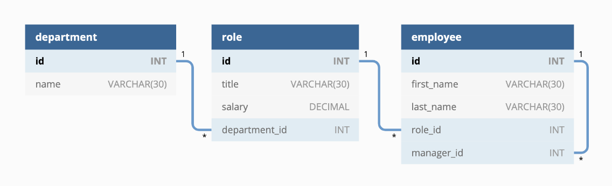

# Employee Tracker

check out the [Walkthrough Video](https://drive.google.com/file/d/1pptHBw5KprhblyS2n2AVz5LuV7JmaqCi/view)

## Description
For this project, I used SQL with the mySql shell to make an employee tracker. This application uses raw SQL queries so that any business owner can keep track of their `departments` (by name and id) which has many `roles` (title, salary, department_id) which has many `employees` (id, first_name, last_name, role_id, manager_id)

## Installation
To install this project, all you need to do is clone the repository name, install mysql2, install the provided dependencies and run node index.js in the directory of your cloned project!

## License
This application is covered under the MIT license.

## Questions
For questions about the project, you can reach me via:
- GitHub: [Lopez-Jordan](https://github.com/Lopez-Jordan)
- Email: jordanlopezemail@gmail.com